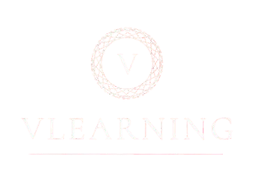

# VLearning - Online Learning Platform



## Project Overview

VLearning is a comprehensive e-learning platform designed to connect students with quality educational content created by expert instructors. The platform facilitates course creation, discovery, enrollment, and learning in a user-friendly environment.

## Key Features

### For Students

- Browse and search courses by categories, skills, and topics
- Course previews and detailed information pages
- Video-based learning with progress tracking
- Course reviews and ratings
- Wishlist functionality for saving courses
- Secure payment processing
- Learning dashboard to track enrolled courses
- Personalized course recommendations

### For Instructors

- Course creation and management tools
- Content organization with chapters and lectures
- Student progress monitoring
- Revenue tracking and wallet management
- Course analytics and student engagement metrics
- Instructor profile customization

### For Administrators

- User management
- Course approval workflow
- Content moderation
- Platform analytics
- System configuration

## Tech Stack

### Frontend

- React with hooks for component logic
- Context API for state management
- React Router for navigation
- Tailwind CSS for styling
- Framer Motion for animations
- Vite as build tool

### Backend

- Spring Boot Java application
- JPA/Hibernate for database operations
- RESTful API architecture
- Authentication and authorization
- File storage for course materials

## Project Structure

```
/
├── BE/                 # Backend Spring Boot application
│   └── KLTN_final/     # Java project directory
│
└── FE/                 # Frontend applications
    ├── admin/          # Admin panel React application
    └── client/         # Main client React application
```

## Installation Requirements

### Backend Setup

- Add `application.properties` file to the `resources` folder
- Create a `storage` folder at the same level as `java` and `resources` with the following subfolders:
  - `avatar`
  - `background`
  - `course`
  - `lecture`

### Frontend Setup

- Run `npm install` in both `FE/admin` and `FE/client` directories
- Configure environment variables as needed

## Team Members

### Project Leader & Backend Developer

- **Nguyen Huu Thang**
  - Role: Project Leader, Backend Developer
  - Responsibilities: System architecture, database design, API development

### Frontend Developers

- **Nguyen Duong Truong Vu**
  - Responsibilities: Frontend architecture, component development
- **Tran Huu Khiem**

  - Responsibilities: UI/UX design, responsive layouts, user interactions

- **Nguyen Ba The Vien**

  - Responsibilities: State management, API integration, frontend features

- **Tran Duy Long**
  - Responsibilities: Course viewing experience, video integration, user dashboard

## License

© 2025 VLearning. All rights reserved.

# Project Setup with Docker and Ngrok

This repository contains a full stack application with Spring Boot backend and React/React Native frontends. The setup includes Docker configurations for each component and ngrok integration for exposing services externally.

## Prerequisites

- Docker and Docker Compose
- Ngrok account and authtoken

## Getting Started

1. Clone this repository
2. Create a `.env` file in the root directory with the following content:

   ```
   # Docker environment variables
   NGROK_AUTH_TOKEN=your_ngrok_auth_token_here

   # Backend environment variables
   SPRING_PROFILES_ACTIVE=prod

   # Frontend environment variables
   REACT_APP_API_URL=https://localhost:8080
   ```

3. Replace `your_ngrok_auth_token_here` with your actual ngrok auth token

## Running the Application

Start all services:

```bash
docker-compose up -d
```

## Accessing the Applications

- Backend: http://localhost:8080
- Frontend Client: http://localhost:3000
- Admin Panel: http://localhost:3001
- Ngrok URLs: Check Docker logs to see the generated ngrok URLs

```bash
# View ngrok backend URL
docker-compose logs ngrok-backend | grep "started tunnel"

# View ngrok frontend URL
docker-compose logs ngrok-frontend | grep "started tunnel"
```

## Stopping the Application

```bash
docker-compose down
```

## Project Structure

- `/BE/KLTN_final`: Spring Boot backend
- `/FE/client`: React frontend client
- `/FE/admin`: React admin panel
- `/FE/mobile`: React Native mobile app

## Notes

- The ngrok services expose the backend and frontend to the internet with public URLs
- Each URL is generated dynamically by ngrok
- The URLs will change each time the services restart unless you use a paid ngrok account
